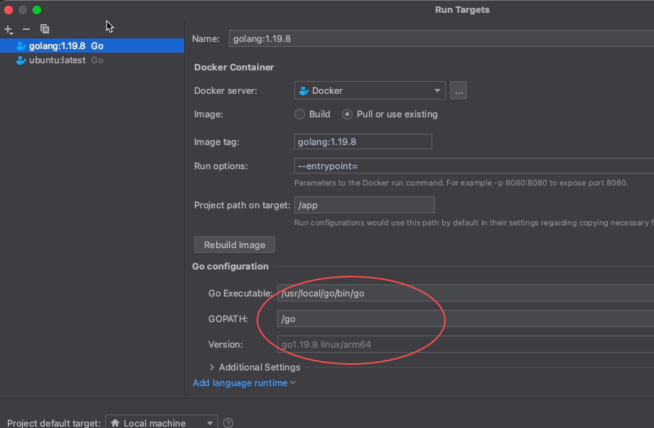

## Problems you may meet
### Can't run process:...File Sharing...
```
Can't run process: java.util.concurrent.CompletionException: 
com.github.dockerjava.api.exception.DockerException: Status 500: 
Status 500: Mounts denied: The path 
/Applications/GoLand.app/Contents/plugins/go-plugin/lib/dlv/linuxarm
 is not shared from the host and is not known to Docker. 
 You can configure shared paths from 
 Docker -> Preferences... -> Resources -> File Sharing. 
 See https://docs.docker.com/desktop/mac for more info.
```
**Solve**: just do as the message told you.

### xx
```
/tmp/118e2d1b-90e4-47b7-8e7b-2525185047ec/dlv --listen=0.0.0.0:53209 --headless=true --api-version=2 --check-go-version=false --only-same-user=false exec /tmp/0abcc8d1-ce02-40db-9a45-864091339b96/___go_build_main_go --
qemu-x86_64: Could not open '/lib64/ld-linux-x86-64.so.2': No such file or directory
```
**Reason**: you specified wrong Language Runtime information in Run Targets Dialog.
**Solve**: specify right language runtime.

## Reference
- https://www.jetbrains.com/help/go/run-targets.html#docker
- https://blog.jetbrains.com/go/tag/containers/